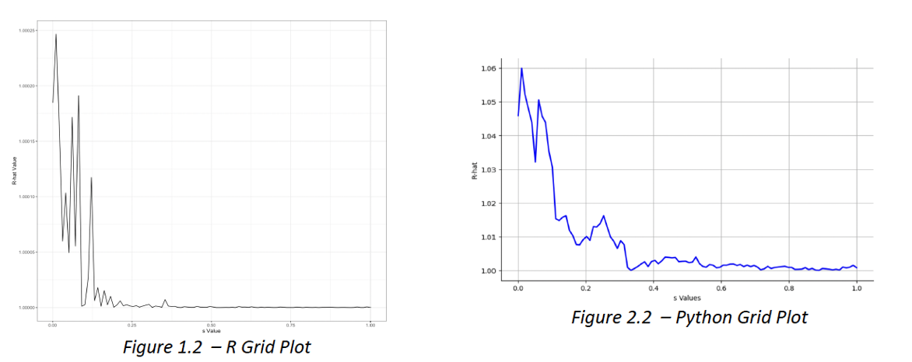

# Random Walk Metropolis Simulation

As part of my *Programming for Data Science* coursework, this project implements the **Random Walk Metropolis (RWM) algorithm** in Python and R to generate random samples from a target probability density function (PDF).

---

## Project Overview
The **Random Walk Metropolis algorithm** is a Markov Chain Monte Carlo (MCMC) method used for sampling from complex probability distributions.
In this project, I:
- Implemented the algorithm **from scratch** in both Python and R.
- Simulated **10,000 iterations** using a defined step size.
- Visualized the sampled values to confirm they reflect the target distribution.

---

## Key Features
- **Custom Implementation:** Built the RWM algorithm from scratch.
- **Cross-Language Comparison:** Implemented in **both Python and R** to validate results.
- **Convergence Visualization:** Generated overlaying plots and histograms to confirm accurate sampling.

---

## Files
- Python code of this project can be found [here](ST2195_Part_1.ipynb), and R code [here](https://nichkohlas.github.io/Random-Walk-Metropolis-Simulation/220459392_Part_1.html).

## Results
- **Sampling Accuracy:** The histogram and kernel density plots of the simulated samples closely match the target distribution, confirming proper convergence.
- **Monte Carlo Estimates:**
  - Mean of sampled vallues: **≈ 0.05**
  - Standard Deviation of sample values: **≈ 1.63**
- **Convergence Diagnostic (R-hat):**
  - The R-hat value provides a way to quantify whether multiple chains of a model are converging to the same distribution.
  - In ideal circumstances, the **R-hat value should approach 1**, indicating that all chains are sampling from the same underlying distribution.
  - **Values greater than 1.1 suggests non-convergence**, requiring further iterations or parameter adjustments.
  - In this project, the R-hat value approached 1 for well-tuned step sizes, confirming good chain mixing and convergence.
 
  
*Grid Plot of R-hat values over varying tuning parameter (s) (Python & R implementation)*

## Skills Used
- **Programming Languages:** Python, R
- **Statistical Techniques:** Markov Chain Monte Carlo (MCMC), Random Walk Metropolis (RWM) algorithm, Convergence Diagnostics (R-hat)
- **Data Visualization:** ggplot (R), matplotlib (Python)
- **Reproducible Reporting:** R Markdown, Jupyter Notebook

